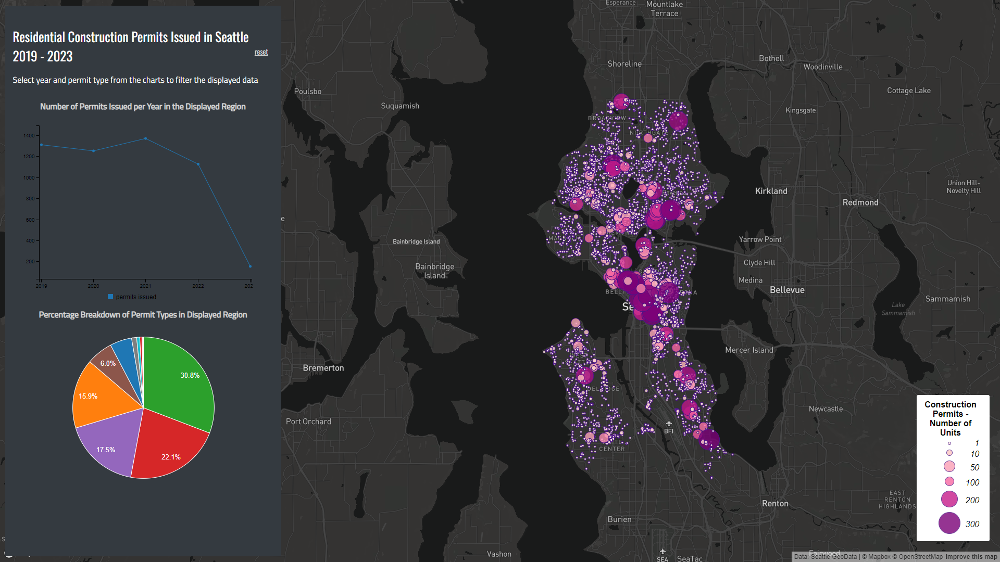

# Geography 458 Smart Dashboard Lab

The dashboard is accessible [here](https://ehl7.github.io/geog458_Smart_Dashboard/).

This smart dashboard visualizes residential construction permits issued in Seattle between January 1st, 2019 and December 31st, 2023. The dashboard is built on the template provided by Professor Bo Zhao for Geography 458 and uses data from Seattle GeoData. The two charts were built using the C3.js Javascript library. I chose to use a proportional symbol map to visualize the locations of the issued permits. The size of the symbols represents the number of new units that the building will contain. A proportional symbol map is a good choice as opposed to a choropleth map because I am visualizing the actual point locations as opposed to aggregate data within regions. Also I am visualizing the raw count of the units opposed to a rate or proportion.